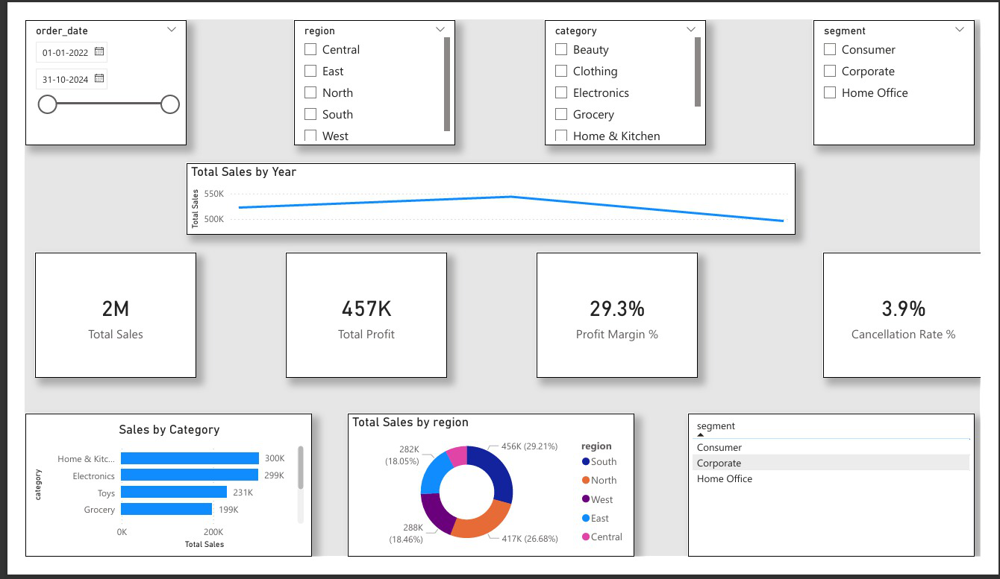
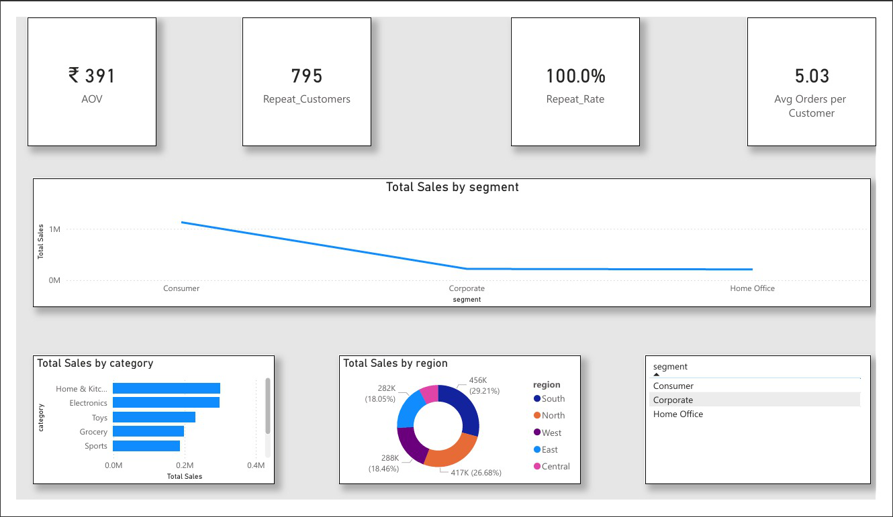

# 📊 Retail Sales Analytics — Power BI Project (Data Analyst Portfolio)

An end-to-end **Data Analytics & Business Intelligence** project using **SQL, Power BI, DAX, Excel, and Power Query** to analyze retail sales performance, customer behavior, and product profitability.

This project demonstrates complete workflow skills required for a **Data Analyst**:  
data cleaning → data modeling → DAX → dashboard design → business insights.

---

## 🔧 Tech Stack
- **SQL**
- **Power BI Desktop**
- **Power Query (ETL)**
- **DAX (KPIs & Measures)**
- **Excel**
- **Data Modeling (Star Schema)**
- **GitHub Documentation**

---

## 🚀 Project Overview

Retail companies struggle with tracking sales performance, identifying profitable products, and understanding customer behavior.  
This project solves that by building an interactive analytics dashboard that highlights:

- Sales trends  
- Product/category performance  
- Regional behavior  
- Customer insights  
- Profitability metrics  

All insights are generated from raw data using industry-standard BI techniques.

---

## 🧩 Business Problem

Key challenges faced by retail businesses:

- No clarity on which **products** drive revenue  
- Lack of insight into **customer segments**  
- Poor understanding of **regional sales**  
- Difficulty in tracking **profit margins**  
- Inability to identify **repeat customers** and loyalty patterns  

This project provides a data-driven solution using dashboards and KPIs.

---

## 🎯 Project Goal

Build a complete **Data Analyst workflow** to:

- Clean & transform raw retail data  
- Build a star schema model  
- Create DAX calculations for KPIs  
- Design interactive dashboards  
- Generate insights for business decisions  

The dashboard contains **two analytical pages**.

---

## 🔹 Page 1 — Sales Performance Dashboard

- ⭐ Total Sales  
- ⭐ Total Profit  
- ⭐ Profit Margin %  
- ⭐ Cancellation Rate  
- 📊 Sales by Category (Bar Chart)  
- 🥧 Sales by Region (Donut Chart)  
- 📈 Yearly Sales Trend  
- 🔄 Segment Slicer + Trend  

---

## 🔹 Page 2 — Customer & Product Insights

- 💰 Average Order Value (AOV)  
- 🔁 Repeat Customers  
- 🔁 Repeat Rate (%)  
- 📦 Avg Orders per Customer  
- 📊 Sales by Category  
- 🥧 Sales by Region  
- 🔄 Customer Segment Insights  

---

## 🛠 DAX Measures Created

Some important DAX formulas used:

- `Total Sales = SUM(Sales[Sales Amount])`
- `Total Profit = SUM(Sales[Profit])`
- `Profit Margin = [Total Profit] / [Total Sales]`
- `AOV = [Total Sales] / DISTINCTCOUNT(Customer[Customer ID])`
- `YoY Sales = CALCULATE([Total Sales], DATEADD(Date[Date], -1, YEAR))`

(Full DAX file included in repository.)

---

## 📁 Project Files

| File | Description |
|------|-------------|
| `Retail_Sales_Analytics_Project1.pbix` | Main Power BI dashboard |
| `Retail_Sales_Analytics_Dashboard.pdf` | Exported PDF overview |
| `Retail_Sales_Analytics_Queries.sql` | SQL queries used for analysis |
| `Images/dashboard_page_1.png` | Screenshot – Sales Performance |
| `Images/dashboard_page_2.png` | Screenshot – Customer Insights |

---

## 📸 Dashboard Preview

### **Page 1 – Sales Performance**

### **Page 2 – Customer & Product Insights**

---

## 📈 Key Insights

- **Consumer segment** generates the highest revenue  
- **Technology** category leads in overall sales  
- **West region** performs significantly better  
- **Repeat customers** contribute heavily to profit  
- **AOV** indicates stable purchasing behavior  
- Identified weak-performing regions and categories  

---

## ▶ How to Use the Dashboard

1. Download the `.pbix` file from the repository  
2. Open it using **Power BI Desktop**  
3. Explore slicers, filters, and multi-page insights  

---

## 👤 Author

### **G. Shyam Venkat**  
**Data Analyst | SQL | Power BI | DAX | Excel | Data Modeling**

🔗 GitHub: https://github.com/shyamcodes-ai  
🔗 LinkedIn: https://www.linkedin.com/in/g-shyam-venkat-304ab536b  

---

⭐ If you like this project, consider giving the repository a star!
